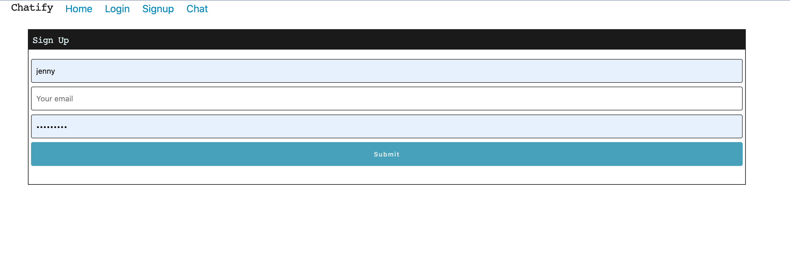

# react-user-portfolio

# Description

This chat application allows users to post their messages in a chat room upon successful login. Users can post their messages, edit and delete them. A future goal for this application is to enable it to listen to subscription of messages and send them in real-time 

# Installation

Clone the social-network-app repository to your local machine. Start the application using the `npm run start` command.

# User Story

As A User I want to see all my posted messages in the Chat Room 
AS A User I want to post my messages so that my fellow classmates can read my messages 
As A User I want to be able to delete any of my posted messages 

# Usage

# Link to deployed app on Heroku
https://damp-lake-71449.herokuapp.com/

# Link to the GitHub Repository

https://github.com/taniachahal97/social-network-app

